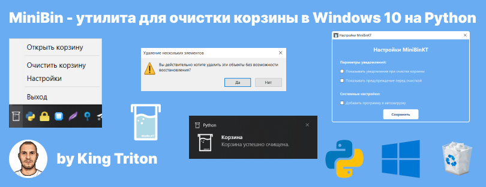

# Minibin - Утилита для Очистки Корзины в Windows 10/11




[](LICENSE)


[](#contributors)

## Особенности

* **Очистка всех дисков**: утилита очищает корзину не только на диске C, но и на всех остальных логических дисках (E, B, D и т.д.).
* **Настройки**: позволяет скрыть/показать уведомление, предупреждение и добавляет/удаляет программу в автозагрузку.
* **Динамическая иконка в трее**: программа динамически отображает статус корзины в иконке в системном трее.

## Установка

1. Скачайте последний релиз из [репозитория](https://github.com/king-tri-ton/minibin/releases).
2. Разархивируйте архив в удобное место на вашем компьютере.

## Использование

1. Запустите программу, щелкнув 2 раза по `minibin-kt.exe`.
2. Щёлкните правой кнопкой мыши на иконке в трее для отображения доступных опций:

   * **Открыть корзину** - открыть стандартное окно корзины.
   * **Очистить корзину** - удалить все файлы из корзины на всех дисках.
   * **Настройки** - настройте утилиту под себя.
   * **Выход** - закрыть программу.

## Информация о Ярлыке Корзины

Если вы хотите избавиться от ярлыка корзины на рабочем столе, вы можете следовать инструкциям на [remontka.pro](https://remontka.pro/remove-recycle-bin-windows/).

## Удаление программы

Minibin — это portable-приложение, которое не требует установки. Однако программа сохраняет свои настройки в реестре Windows.

### Что остается в системе после удаления:

1. **Настройки программы** в ключе реестра:
   ```
   HKEY_CURRENT_USER\Software\MiniBinKT
   ```
   (здесь хранятся параметры уведомлений и предупреждений)

2. **Запись автозагрузки** (если была включена) в ключе:
   ```
   HKEY_CURRENT_USER\Software\Microsoft\Windows\CurrentVersion\Run
   ```

### Как полностью удалить Minibin:

1. Закройте программу (ПКМ по иконке в трее → Выход)
2. Удалите файл `minibin.exe`
3. *(Опционально)* Очистите записи реестра одним из способов:

**Способ 1: Через редактор реестра**
- Нажмите `Win + R`, введите `regedit` и нажмите Enter
- Перейдите в `HKEY_CURRENT_USER\Software\`
- Найдите и удалите папку `MiniBinKT`
- Если использовали автозагрузку: перейдите в `HKEY_CURRENT_USER\Software\Microsoft\Windows\CurrentVersion\Run` и удалите запись `MiniBinKT`

**Способ 2: Через командную строку**
- Запустите командную строку от имени администратора
- Выполните команды:
  ```batch
  reg delete "HKCU\Software\MiniBinKT" /f
  reg delete "HKCU\Software\Microsoft\Windows\CurrentVersion\Run" /v MiniBinKT /f
  ```

> **Примечание:** Записи в реестре занимают минимум места и не влияют на работу системы. Их удаление не обязательно, но рекомендуется для полной очистки.

## Персонализация

### Пользовательские иконки

Minibin позволяет заменить стандартные иконки корзины на свои собственные.

**Как изменить иконки:**

1. Откройте настройки программы (ПКМ по иконке в трее → Настройки)
2. В разделе "Персонализация" выберите иконку для пустой или полной корзины
3. Нажмите кнопку "Выбрать" и укажите путь к файлу `.ico`
4. Перезапустите программу для применения изменений

**Требования к иконкам:**
- Формат файла: `.ico`
- Рекомендуемый размер: 16x16, 32x32 или 48x48 пикселей
- Иконки должны быть доступны по указанному пути (не удаляйте файлы после выбора)

**Сброс на стандартные иконки:**
- Нажмите кнопку "Сбросить" напротив нужной иконки
- Перезапустите программу

> **Примечание:** Пути к пользовательским иконкам сохраняются в реестре Windows (`HKCU\Software\MiniBinKT`). При удалении программы MiniBinKT эти записи останутся, но не будут влиять на работу системы.

### Стандартные иконки

Стандартные иконки в трее созданы [автором проекта](https://github.com/king-tri-ton/) и используются с разрешения. Вы можете найти их в папке `icons/` исходного кода или внутри скомпилированного `.exe` файла.

---

## Contributors

<table>
  <tbody>
    <tr>
      <td align="center" valign="top" width="20%">
        <a href="https://github.com/king-tri-ton">
          <br />
          <sub><b>king-tri-ton</b></sub>
        </a><br />
        Автор проекта
      </td>
      <td align="center" valign="top" width="20%">
        <a href="https://github.com/MYRSGRAL">
          <br />
          <sub><b>MYRSGRAL</b></sub>
        </a><br />
        Вклад в разработку
      </td>
      <td align="center" valign="top" width="20%">
        <a href="https://github.com/kobaltgit">
          <br />
          <sub><b>kobaltgit</b></sub>
        </a><br />
        Вклад в проект
      </td>
    </tr>
  </tbody>
</table>

---

## Контакты

По вопросам и предложениям:

- Telegram: [@king_tri_ton](https://t.me/king_tri_ton)
- Email: [mdolmatov99@gmail.com](mailto:mdolmatov99@gmail.com)
- или создавайте issues

---

by **King Triton**