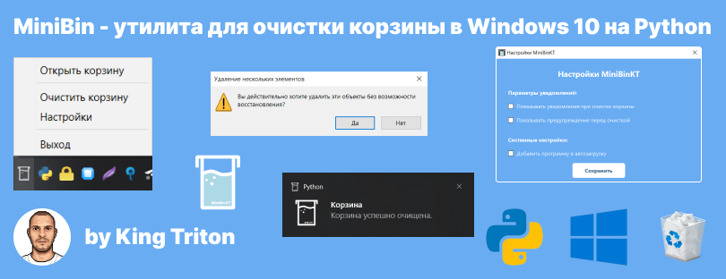

# Minibin - Утилита для Очистки Корзины в Windows 10/11


[](LICENSE)


[](#contributors)



## Особенности

* **Очистка всех дисков**: утилита очищает корзину не только на диске C, но и на всех остальных логических дисках (E, B, D и т.д.).
* **Динамическая иконка в трее**: программа динамически отображает статус корзины в иконке в системном трее.
* **Кастомизация кликов мыши**: вы можете назначить разные действия (очистка, открытие корзины, настройки) на одиночный и двойной клик по иконке.
* **Интерфейс на вкладках (Tabs)**: настройки разбиты на категории, а само окно стало максимально компактным, минималистичным и не занимает много места.
* **Автозагрузка и уведомления**: гибкая настройка предупреждений, всплывающих окон и автозапуска вместе с Windows.

## Установка

1. Скачайте последний [релиз](https://github.com/king-tri-ton/minibin/releases).
2. Разархивируйте архив в удобное место на вашем компьютере.
3. Запустите `MiniBinKT.exe`.

## Использование

1. Запустите программу, щёлкнув 2 раза по `MiniBinKT.exe`.
2. Управляйте утилитой через иконку в системном трее:
   * **Одиночный левый клик** — выполняет назначенное вами действие (по умолчанию: *Очистить корзину*).
   * **Двойной левый клик** — выполняет второе назначенное действие (по умолчанию: *Открыть настройки*).
   * **Правый клик (ПКМ)** — открывает контекстное меню со всеми доступными опциями:
     * **Открыть корзину** — открыть стандартное окно проводника с корзиной.
     * **Очистить корзину** — моментальное удаление файлов на всех дисках.
     * **Настройки** — открыть менеджер параметров.
     * **Выход** — закрыть программу.

## Информация о Ярлыке Корзины

Если вы хотите избавиться от ярлыка корзины на рабочем столе, вы можете следовать инструкциям на [remontka.pro](https://remontka.pro/remove-recycle-bin-windows/).

## Удаление программы

Minibin сохраняет свои настройки в реестре Windows.

### Что остается в системе до удаления:

1. **Настройки программы** в ключе реестра:

```

HKEY_CURRENT_USER\Software\MiniBinKT

```
(здесь хранятся параметры уведомлений, пути к кастомным иконкам и действия для кликов мыши)

2. **Запись автозагрузки** (если была включена) в ключе:

```

HKEY_CURRENT_USER\Software\Microsoft\Windows\CurrentVersion\Run

```

### Как полностью удалить Minibin:

1. Закройте программу (ПКМ по иконке в трее → Выход)
2. Удалите файл `minibin.exe` / `MiniBinKT.exe`
3. *(Опционально)* Очистите записи реестра одним из способов:

**Способ 1: Через редактор реестра**
- Нажмите `Win + R`, введите `regedit` и нажмите Enter
- Перейдите в `HKEY_CURRENT_USER\Software\`
- Найдите и удалите папку `MiniBinKT`
- Если использовали автозагрузку: перейдите в `HKEY_CURRENT_USER\Software\Microsoft\Windows\CurrentVersion\Run` и удалите запись `MiniBinKT`

**Способ 2: Через командную строку**
- Запустите командную строку от имени администратора
- Выполните команды:
```batch
reg delete "HKCU\Software\MiniBinKT" /f
reg delete "HKCU\Software\Microsoft\Windows\CurrentVersion\Run" /v MiniBinKT /f

```

> **Примечание:** Записи в реестре занимают минимум места и не влияют на работу системы. Их удаление не обязательно, но рекомендуется для полной очистки.

## Персонализация

### Пользовательские иконки

Minibin позволяет заменить стандартные иконки корзины на свои собственные через вкладку **"Иконки"** в настройках приложения.

**Как изменить иконки:**

1. Откройте настройки программы (вкладка "Иконки").
2. Выберите иконку для пустой или полной корзины, нажав кнопку **"Выбрать"**.
3. Укажите путь к файлу `.ico` и перезапустите программу.

**Требования к иконкам:**

* Формат файла: `.ico`
* Рекомендуемый размер: 16x16, 32x32 или 48x48 пикселей.
* Не удаляйте и не перемещайте файлы иконок после выбора.

### Настройка поведения кликов

На вкладке **"Взаимодействие"** вы можете переназначить функции для левой кнопки мыши. Система автоматически проверяет, чтобы одно и то же действие (например, очистка) не было одновременно назначено на оба типа клика, предотвращая конфликты интерфейса.

---

## Contributors
<table>
  <tbody>
    <tr>
      <td align="center" valign="top" width="20%">
        <a href="https://github.com/king-tri-ton">
          <br />
          <sub><b>king-tri-ton</b></sub>
        </a><br />
        Автор проекта
      </td>
      <td align="center" valign="top" width="20%">
        <a href="https://github.com/MYRSGRAL">
          <br />
          <sub><b>MYRSGRAL</b></sub>
        </a><br />
        Вклад в разработку
      </td>
      <td align="center" valign="top" width="20%">
        <a href="https://github.com/kobaltgit">
          <br />
          <sub><b>kobaltgit</b></sub>
        </a><br />
        Вклад в проект
      </td>
    </tr>
  </tbody>
</table>

---

## Контакты

По вопросам и предложениям:

* Telegram: [@king_tri_ton](https://t.me/king_tri_ton)
* Email: [mdolmatov99@gmail.com]()
* или создавайте issues

---

## 🌟 Поддержите проект

Если проект вам понравился:

* ⭐ Поставьте звезду
* 📢 Поделитесь с друзьями
* 💬 Напишите отзыв в Telegram

---

by **King Triton**
